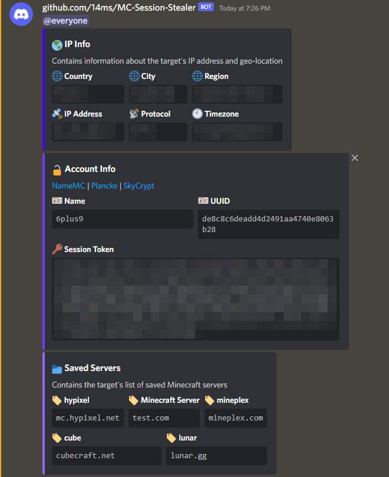

# MC-Session-Stealer
Simple Session-Token stealer written as a forge mod for Minecraft 1.8.9

# ⚠️ Disclaimer
This program is for educational purposes only, and I am not responsible for any of your actions

## 🎉 Features
- Uses Discord webhooks to transfer stolen data
- Easy to integrate into another mod's code
- No additional libraries required

## 📦 Steals
- Minecraft
    - Account
      - Name
      - UUID
      - Session-Token
    - Saved Servers
- Geo-Location
    - IP Address
      - Protocol
    - Country
    - City
    - Region
    - Timezone

## 📷 Preview
